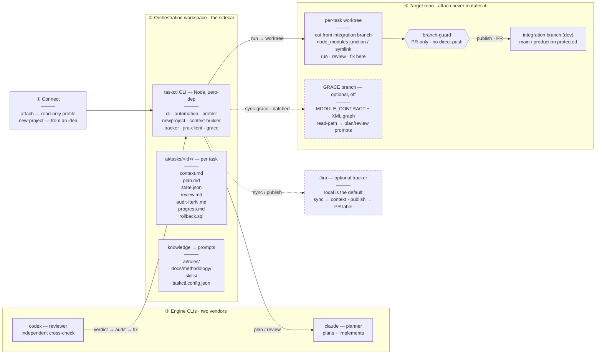

# taskctl

> **Pre-alpha** (release tag `v0.1.0-prealpha`). Dogfooded only on its own extraction — no
> third-party use yet, no package-manager release. Expect rough edges; behaviour may change.

**taskctl** is the engine an **AI orchestrator drives on your behalf** to run a disciplined,
**multi-model** software-development lifecycle on top of the coding agents you already use
(e.g. Claude Code + Codex CLI). You open a coding-agent session in an orchestration workspace;
the agent — following the harness it loads (its role in `CLAUDE.md` + the task playbook) —
frames tasks, runs each through cross-model review, and drives the stages *in the background*,
pausing to ask you only at the decisions that matter. You talk to the orchestrator; taskctl is
the machinery under the hood. *(Prefer full control? Be the orchestrator yourself and run the
CLI by hand — same commands, same discipline.)*

Its premise: a single AI model reviewing its own work has correlated blind spots, and
unattended automation hides the bugs that matter. So taskctl runs each task through stages
where — by default — **a different engine reviews the work**, around one discipline it expects
the orchestrator (the agent, or you) to apply: **independently verify every reviewer finding
before acting on it** — the [`orchestrator-verify`](skills/orchestrator-verify/SKILL.md) skill.

Two honest framings up front:

- **taskctl is the harness, not the autopilot.** It frames tasks, generates the cross-model
  prompts, runs an inspectable stage machine, isolates work in git, and keeps verdicts and
  artifacts. The *judgement* — verifying findings, deciding what's real, what ships — is the
  orchestrator's, by design.
- **The verify step is a discipline, not a CLI feature.** The shipped automation does not
  auto-generate or enforce the orchestrator audit; the methodology and the
  `orchestrator-verify` skill define it, and you (or your supervising agent) perform it
  between stages. The unattended `--auto` loops deliberately skip it (see below).

It is **not** another autonomous coding agent. It is the *orchestration discipline* that sits
on top of one — the part that decides what gets planned, who reviews it, what counts as done,
and what is allowed to leave your machine.

---

## Why it exists

This tool was extracted from a private single-project workspace where it drove ~95 real
tasks. Mining that history surfaced what actually produced quality (and what didn't):

- **Cross-vendor adversarial review is the moat.** One engine plans and implements; a
  *different* engine (ideally a different vendor) reviews. No single vendor builds this — it
  pits two providers against each other, and their blind spots are far less likely to overlap. *(taskctl's
  defaults assign different engines to the planner and reviewer roles; it does not force them
  to differ — you can configure the same one.)*
- **The reviewer is input, not authority.** Reviewers hallucinate stale line numbers, invent
  identifiers, and flag things out of scope. So the methodology requires the orchestrator to
  re-read every Critical/Important finding against the cited code, classify it (real /
  theoretical / false positive), and record an **audit artifact** — every iteration — before
  any fix. This caught real bugs the reviewer missed *and* killed false alarms. taskctl
  provides the cross-model prompts and the stage gate; running the audit is the orchestrator's
  job (the `orchestrator-verify` skill encodes it).
- **The discipline is the product, not the automation.** Unattended `--auto` loops exist but
  were deliberately bypassed in real use in favour of human-gated single stages with an
  inspection — and the audit — between them.
- **Analyze, don't assume.** Before driving a repo, taskctl reads it (read-only) and derives
  its config, instead of being hard-wired to one project's conventions.

These patterns are not aspirations — the build of *this* repository followed them. The
extraction was dogfooded through the same loop: every work package was plan-reviewed and
code-reviewed by a second model with orchestrator audits, which caught three architecture-level
design holes, two data-loss paths, and a concurrency race **before a line shipped**. The
methodology is in [`docs/methodology/`](docs/methodology/); the mining evidence in
[`docs/analysis/`](docs/analysis/).

---

## How it all fits together

The whole tool in one view — how an existing repo is attached, where per-task context, rules and
skills live, and where the engines, Jira, worktrees and the optional GRACE branch sit.



*Legend: solid = core flow · dashed = optional / read-only · hexagon = branch-guard (PR-only).*

---

## The lifecycle — how a task moves

Every task advances through inspected stages. The verdicts and feedback loops are the point:

```
 frame ──▶ plan ──▶ plan-review ──▶ run ──▶ review ──▶ publish
           │            │                     │
           ▼            ▼ NEEDS REVISION       ▼ NEEDS WORK
        context.md    revise ⟲ (loop)        fix ⟲ (loop)
                      until APPROVE           until APPROVE

 stages:  analysis → planned → plan_reviewed → running → review → done
```

1. **Frame** — `taskctl new <slug>` (local, no tracker) or `taskctl sync <task-id>`
   (from a tracker) produces a `context.md`: the problem, acceptance criteria, constraints.
2. **Plan** — `taskctl do plan <task-id>`: the **planner** engine writes a `plan.md`,
   grounded empirically (the discipline: ping the live API / DB / schema before committing
   assumptions — *live truth > docs > inference*).
3. **Plan-review** — `taskctl do plan-review <task-id>`: a **different** engine (by default)
   reviews the plan against the cited code and returns `APPROVE` / `NEEDS REVISION`. The
   orchestrator then **verifies each finding** against the code and records an audit before
   forwarding confirmed findings to `revise`; the loop repeats to `APPROVE`. *(This verify
   step is the discipline, not an automatic CLI action.)* This stage routinely catches design
   bugs before any code is written.
4. **Run** — `taskctl do run <task-id>`: the planner implements the approved plan in a
   per-task **git worktree**. The execution prompt requires the agent to run the build, tests,
   and type-check — though taskctl does not itself verify those results before you finalize the
   stage.
5. **Review** — `taskctl do review <task-id>`: cross-model **code** review of the diff, the
   orchestrator verifies again, `fix` loops to `APPROVE`.
6. **Publish** — `taskctl publish <task-id> --repo-path <p>`: attempts to commit, push, and open
   a PR (explicit, opt-in; PR-only **by convention** — not a CLI-enforced protected-branch guard).
   *Currently requires `tracker.type:"jira"` — see Limitations.*

By default you drive one stage at a time and look at the diff/plan in between. `do <stage>`
runs *prepare → engine → finalize* for a single stage. The chained automations — `flow` (stages
with feedback loops), `autopilot` (full cycle), and the `--auto` / `--flip` loops — forward a
failed review **straight to a fix and so skip the orchestrator-verify step**; they're a
risk-accepting opt-in (see [flipped-flow.md](docs/methodology/flipped-flow.md)).

---

## Getting started

A first run, end to end. (`taskctl` below is shorthand for `node taskctl/cli.mjs` — alias it
if you like.)

**1 · Prerequisites.** Node.js ≥ 18, plus the engine CLIs you intend to use — by default the
`claude` and `codex` CLIs, **each already authenticated** in your shell. The cross-model loop
needs *two distinct* engines to be meaningful; with only one, set both roles to it and accept
the loss of the cross-vendor benefit.

**2 · Get taskctl and smoke-test it.** No package-manager release yet — clone and run the CLI
directly:

```
git clone https://github.com/fotowizzard/taskctl-oss && cd taskctl-oss
node taskctl/cli.mjs --help
cd taskctl && npm test     # 325 tests, Node's built-in runner, zero deps
```

**3 · Point it at your work** — two entry paths (detailed in *Two ways in* below):

```
taskctl attach <path-to-existing-repo>     # read-only profile → taskctl.config.json
taskctl init-harness                       # scaffold the harness layer (contract, onboarding, monitor)
taskctl new-project "<your idea>"          # idea → scaffold → backlog → attach
```

`attach` derives a `taskctl.config.json` into your orchestration workspace (the sidecar) and
never touches the target repo. From there, author work with `taskctl new <slug>` (a local
task) or `taskctl sync <task-id>` (from a tracker).

**4 · Drive the first stage, then look before advancing:**

```
taskctl do plan <task-id>         # planner writes plan.md  → read it
taskctl do plan-review <task-id>  # a different engine reviews it → you verify the findings
```

Continue through `run → review → publish` as the task moves. That drive-inspect-verify-advance
rhythm, one stage at a time, *is* the methodology; the chained automations (`flow`,
`autopilot`, `--auto`) are for when you knowingly trade it away.

---

## Two ways in

### Attach to an existing repo (read-only)

```
taskctl attach <repo-path> [--force]
```

A **strictly read-only** profiler: it reads files and runs read-only git queries (a frozen
allow-list of five fixed commands — mutating git is *inexpressible*, the wrapper takes no
caller argv), and never runs a build/test command in the target. It detects the stack, package
manager, build/test/lint commands, default + integration branches, and code-area structure,
prints a **Project Understanding** summary, and writes a derived `taskctl.config.json` into
your orchestration workspace (the **sidecar**) — not the target. A failed attach leaves zero
trace.

*One documented exception — self-attach:* when the target **is** the orchestration workspace
itself (`configRoot === target`), the config lands inside it by design. For any *foreign* repo,
a write destination resolving inside the target is rejected outright.
→ [docs/quickstart-attach.md](docs/quickstart-attach.md)

### Start a new project from an idea

```
taskctl new-project "<your idea in a sentence>"
```

A resumable, checkpointed flow: **brainstorm** (sharpen the concept) → **proposal** (a stack +
architecture with alternatives) → **print-only scaffold** (it prints the exact commands; *you*
run them — it never executes engine-authored shell) → **backlog** (the idea decomposed into
local tasks) → **self-attach** (a generated `taskctl.config.json`). The result is a
self-contained workspace ready to run the lifecycle.
→ [docs/quickstart-new-project.md](docs/quickstart-new-project.md)

### Scaffold the harness layer

```
taskctl init-harness [--name <project>] [--dry-run]
```

Once a workspace has a `taskctl.config.json` (from `attach` or `new-project`), `init-harness`
materializes the **harness layer** — the operating contract (`CLAUDE.md`), onboarding (`SETUP.md`,
`onboarding/`), a session-state monitor, a GRACE skeleton and the task playbook — filling the
placeholders from the config, `.env` and the target's git remote. It **never overwrites**: absent
files are written, unchanged files skipped, and a file you have edited is kept untouched;
`--dry-run` previews.
→ [docs/harness.md](docs/harness.md)

---

## Features

- **Pluggable task source.** `local` (no tracker — author tasks with `taskctl new`) is the
  default; a `jira` adapter wraps the Jira flow when you want it. Credentials stay in env,
  never in config.
- **Config-driven, not project-wired.** `repoPath`, branches, engines, prompt language, and
  per-project context/constraints/code-areas are configurable with **project-neutral
  defaults** — no origin-project values baked into the code.
- **Pluggable engines.** `planner` and `reviewer` are configurable adapters (claude + codex
  ship; the registry makes others addable, and engine names are validated before a
  state-mutating command runs). Per-role *model* selection isn't configurable yet — a
  single-engine setup means setting both roles to the same adapter.
- **Read-only comprehension layer.** The `attach` profiler derives per-project config by
  analysis; an optional, off-by-default **GRACE** governance tier adds curated cross-module
  contracts for large/critical repos (see the *GRACE* section below).
- **Per-task git worktrees.** A task runs in its own worktree, created from the integration
  branch (fetched when a new branch is cut). Offline or on failure it falls back to a
  cached/local ref, or — if the worktree can't be created — to the main repo. PR-only by
  convention.
- **Automation when you want it.** `do <stage>` (single inspected stage), `flow` (chained with
  feedback loops), `autopilot` (full cycle), plus `--auto` / `--flip` for unattended loops
  (with the no-audit caveat above).
- **Resumable, transactional new-project flow.** It survives interruption — a single flow lock,
  durable checkpoints, atomic publication, and adoption rules that **halt rather than overwrite**
  on any mismatch (so a mid-flow edit is never destroyed). `sync-grace` is separately resumable
  through persisted rebase/conflict state.
- **Honest by construction.** A two-tier scrub gate (regex + a manual checklist) runs in the
  test suite to keep origin-specific identifiers out of shipped docs.

## The command surface (abridged)

`taskctl --help` lists the full set. The core cycle:

```
new <slug>            create a LOCAL task (no tracker)      → context.md + state.json
new-project "<idea>"  idea → scaffold → backlog → attach
plan / plan-review    prepare + cross-model plan review
run / review          implement in a worktree + code review
revise / fix          feedback loops back toward APPROVE
publish               commit + push + open PR (best-effort; requires a Jira tracker today)
do <stage>            prepare + engine + finalize, one stage
flow / autopilot      chain stages / full cycle  (autopilot requires a Jira tracker today)
attach <repo>         read-only profile → taskctl.config.json
status / list / deps  inspect tasks and their dependency graph
```

GRACE governance (`grace-gate`, `sync-grace`) appears only when `grace.enabled: true`.

---

## Configuration

`taskctl.config.json` is optional — every field has a project-neutral default. The minimal
local config:

```json
{ "repoPath": ".", "tracker": { "type": "local" } }
```

The full shape (see [`taskctl.config.example.json`](taskctl.config.example.json) for the
annotated version):

```json
{
  "repoPath": "/path/to/your/repo",
  "tracker": { "type": "jira", "assigneeEmail": "you@example.com" },
  "branches": { "integration": "dev", "prTarget": "dev" },
  "engines": { "planner": "claude", "reviewer": "codex", "reasoningEffort": "high" },
  "promptLanguage": "en",
  "projectContext": ["Tech stack: <your stack>"],
  "constraints": ["PRs only, no direct commits to the integration branch"],
  "codeAreas": { "auth": ["src/auth/"] },
  "grace": { "enabled": false }
}
```

`repoPath: "."` resolves against the config file's own directory, so a workspace is portable
across machines. Jira credentials and `JIRA_PROJECT_KEY` are **env-only**, never JSON — see
[`.env.example`](.env.example).

---

## Methodology & skills

The differentiator ships in two consumable forms — readable methodology for humans, loadable
skills for agents.

**Methodology** ([docs/methodology/](docs/methodology/)): [task-lifecycle](docs/methodology/task-lifecycle.md)
(stages, verdicts, the artifacts each stage produces), [cross-model-review](docs/methodology/cross-model-review.md)
(why a *different* model reviews, reviewer-as-input, the audit that gates every mutation),
[flipped-flow](docs/methodology/flipped-flow.md) (alternating author/reviewer — when, when not,
the `--auto` caveat).

**Skills** ([skills/](skills/)) — six agent-loadable `SKILL.md` files: `orchestrator-verify`,
`cross-model-review`, `empirical-first`, `review-loop-autopilot`, `worktree-isolate`,
`branch-guard`. See the [skills index](skills/README.md).

---

## GRACE — optional governance tier (off by default)

Most repos don't need this — `attach`'s read-only profiler already gives taskctl enough to
drive a project. **GRACE** is an opt-in *second* comprehension layer for the cases where that
isn't enough: large, multi-module, or critical codebases where the expensive mistakes are
**cross-module** — a change that looks correct in one file quietly breaks an invariant three
modules away.

**What it is.** GRACE — Graph-RAG Anchored Code Engineering — is a contract-first methodology:
governed files carry a curated `MODULE_CONTRACT` header, and a small set of XML artefacts
describe the modules, the **edges between them** (a knowledge graph), and verification
scenarios. taskctl *wraps* this methodology — it **reads** those artefacts; it does not vendor
any upstream GRACE code (see *License & attribution*).

**Why it helps — the value is the read-path.** With GRACE enabled, taskctl injects pointers to
the relevant module contracts and knowledge-graph edges **into the planning and review
prompts**. The planner and reviewer then reason over an explicit map of how modules depend on
each other instead of re-inferring it file-by-file — which is exactly what catches a missing
cross-module edge that single-file review would wave through. That acuity, not any gate, is the
reason to turn it on.

**What it deliberately does *not* do.** It does not make every task write contract/XML markup
inline — that would bloat each change. The governance markup is **batched** instead:
`taskctl sync-grace` rebases the governed branch and applies the markup/XML deltas for recently
merged work in one pass (with an optional `grace-gate` lint check). You get the planning acuity
continuously, and pay the bookkeeping cost in periodic batches.

**Turning it on.** Set `"grace": { "enabled": true }` in `taskctl.config.json` and point
`GRACE_REPO_ROOT` at the governed repository. The `grace-gate` and `sync-grace` commands surface
only while it's enabled; with the default `enabled: false`, GRACE is entirely inert — no prompt
changes, no gate runs. The methodology is designed by Vladimir Ivanov; the grace-marketplace
implementation is by Aleksey Chendemerov (osovv) — full credit in [NOTICE](NOTICE).

---

## Status, limitations, platform

**Pre-alpha.** Dogfooded only on its own extraction — not used by third parties, no
package-manager release. Known gaps worth stating plainly:

- The orchestrator audit is a methodology/skill practice, **not enforced by the CLI**;
  `--auto` / `flow` skip it.
- `run --finalize` does **not** verify the build/test results the prompt asked for.
- **`publish` and `autopilot` currently require `tracker.type:"jira"`** — a pure-local project
  runs the lifecycle up to review, then commits/PRs by hand.
- Per-role *model* selection isn't configurable; worktree isolation falls back to local refs /
  the main repo when fetch or worktree creation fails.

[docs/limitations.md](docs/limitations.md) is the fuller accounting (recognised env vars,
deliberate exceptions); [docs/plans/ROADMAP.md](docs/plans/ROADMAP.md) has the phased build.

**Cross-platform:** developed and tested on **Windows 11**; the tool-detection probe chain and
path handling are Windows-first. POSIX (macOS/Linux) is *expected* to work — it's plain
Node.js — but is **UNTESTED** there (e.g. worktree `node_modules` reuse uses a junction on
Windows, a symlink on POSIX). Reports from other platforms are welcome.

---

## License & attribution

taskctl is licensed under the [MIT License](LICENSE) — Copyright (c) 2026 fotowizzard.

The optional, off-by-default governance module **integrates with (wraps, does not vendor)** the
**GRACE** methodology — Graph-RAG Anchored Code Engineering — **designed by Vladimir Ivanov**
([@turboplanner](https://t.me/turboplanner)). An implementation, the
[grace-marketplace](https://github.com/osovv/grace-marketplace) repository (MIT, © GRACE Framework
Contributors), is by **Aleksey Chendemerov** (osovv) — a separate person from the methodology's
designer. See [NOTICE](NOTICE) for the full attribution and how to verify no upstream GRACE code is
vendored here.
